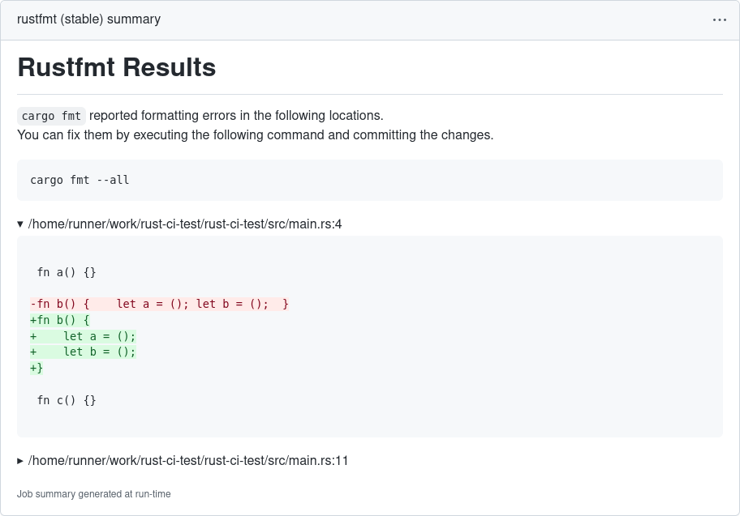
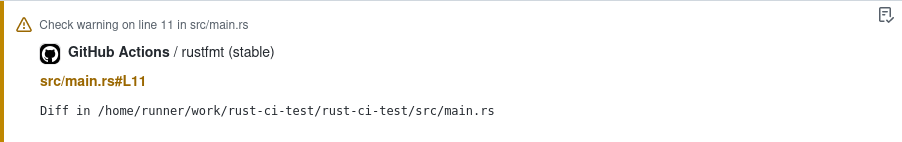

# Run `rustfmt`

Run `cargo fmt --all` and report all formatting differences in a nice overview.
It works best in combination with [`actions-rust-lang/setup-rust-toolchain`] for [problem matcher] highlighting.

Execution Summary:



Problem Matcher:



## Example workflow

```yaml
name: "Test Suite"
on:
  push:
  pull_request:

jobs:
  formatting:
    name: cargo fmt
    runs-on: ubuntu-latest
    steps:
      - uses: actions/checkout@v3
      # Ensure rustfmt is installed and setup problem matcher
      - uses: actions-rust-lang/setup-rust-toolchain@v1
        with:
          components: rustfmt
      - name: Rustfmt Check
        uses: actions-rust-lang/rustfmt@v1
```

## Inputs

All inputs are optional.
If a [toolchain file](https://rust-lang.github.io/rustup/overrides.html#the-toolchain-file) (i.e., `rust-toolchain` or `rust-toolchain.toml`) is found in the root of the repository, it takes precedence.
All input values are ignored if a toolchain file exists.

| Name            | Description                                                              | Default      |
| --------------- | ------------------------------------------------------------------------ | ------------ |
| `manifest-path` | Path to the `Cargo.toml` file, by default in the root of the repository. | ./Cargo.toml |

[`actions-rust-lang/setup-rust-toolchain`]: https://github.com/actions-rust-lang/setup-rust-toolchain
[problem matcher]: https://github.com/actions/toolkit/blob/main/docs/problem-matchers.md
